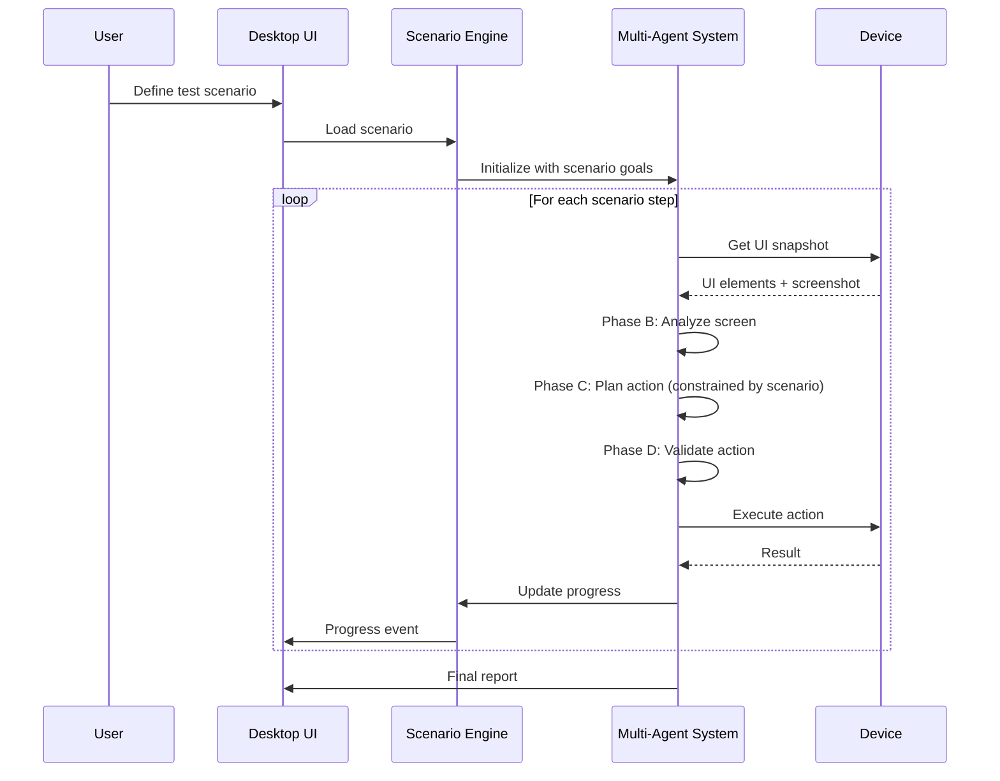
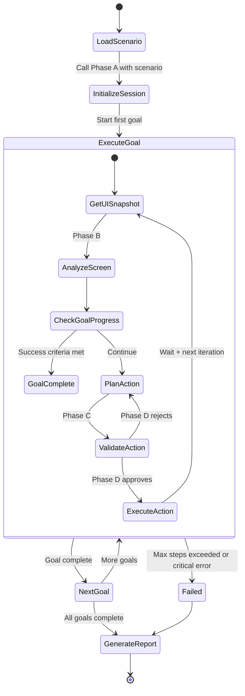

# Design Document: AI-Assisted Smoke Testing Pivot

## Overview

This design transforms Tezzy from a fully autonomous AI exploration agent into an AI-assisted smoke testing tool. The pivot addresses critical issues in the current autonomous approach (navigation loops, low exploration quality, weak memory tracking) by introducing user-defined test scenarios that provide guardrails while preserving the multi-agent system's intelligence for screen understanding, UI adaptation, and self-healing.

The key insight: autonomous exploration is too unconstrained for reliable QA. By having users define test scenarios (login flows, navigation paths, form submissions), we give the AI agents clear goals while they handle the hard parts—understanding dynamic UIs, adapting to layout changes, and detecting visual defects.

This is NOT a downgrade—it's a strategic pivot from "AI explores everything" to "AI executes what you need tested, intelligently." Higher success rates, predictable coverage, and production-ready reliability.

---

## Architecture

### High-Level System Flow



### Multi-Agent System Integration

The existing 8-phase multi-agent system remains intact. Scenarios constrain the agents' decision-making without replacing them:

**Phase A: Session Bootstrap** (ENHANCED)
- Now consumes scenario definition
- Extracts credentials, home markers, and flow goals from scenario
- Sets initial mode based on scenario type (reach_home for login scenarios, explore for navigation scenarios)

**Phase B: Screen Analyst** (UNCHANGED)
- Continues to classify screens and identify interaction targets
- Output feeds into scenario progress tracking

**Phase C: Planner** (ENHANCED)
- Receives current scenario goal as additional context
- Proposes actions that advance toward the goal
- Falls back to exploration when goal is ambiguous

**Phase D: Critic Gate** (ENHANCED)
- Validates actions against scenario constraints
- Rejects actions that violate scenario rules (e.g., "don't navigate away from Settings until all checks complete")

**Phase E: Vision Analyst** (UNCHANGED)
- Continues to detect visual defects
- Findings are tagged with scenario context

**Phase F: Issue Triage** (ENHANCED)
- Correlates findings with scenario expectations
- Distinguishes expected vs unexpected failures

**Phase G: Improvement Advisor** (UNCHANGED)
- Generates recommendations based on scenario results

**Phase H: Final Report** (ENHANCED)
- Produces scenario-based report with pass/fail per goal
- Includes coverage metrics per scenario step

---

## Scenario Schema

### Scenario Definition Format

Scenarios are defined in JSON with a hybrid approach: natural language goals + optional structured hints.

```typescript
interface SmokeScenario {
  id: string;
  name: string;
  description: string;
  app_name: string;
  
  // Credentials for login scenarios
  credentials?: {
    email: string;
    password: string;
  };
  
  // Sequential goals that define the test flow
  goals: ScenarioGoal[];
  
  // Global constraints
  constraints?: {
    max_steps_per_goal?: number;
    timeout_seconds?: number;
    stop_on_first_failure?: boolean;
  };
}

interface ScenarioGoal {
  id: string;
  description: string;  // Natural language: "Login with valid credentials"
  type: GoalType;
  
  // Success criteria (AI validates these)
  success_criteria: string[];  // ["Reach home screen", "See user profile icon"]
  
  // Optional hints to guide the AI
  hints?: {
    expected_screens?: string[];  // ["login", "home"]
    required_actions?: string[];  // ["input_text:email", "input_text:password", "tap:login_button"]
    avoid_actions?: string[];     // ["back", "swipe"]
  };
  
  // Form data for input scenarios
  form_data?: Record<string, string>;
}

type GoalType = 
  | "login"           // Complete login flow
  | "navigate"        // Navigate to specific screen
  | "form_fill"       // Fill and submit form
  | "verify"          // Verify UI state
  | "explore_section" // Explore a bounded section
  | "custom";         // Free-form goal
```

### Example Scenarios

#### Example 1: Login Flow
```json
{
  "id": "login-valid-user",
  "name": "Login with Valid Credentials",
  "description": "Verify user can log in with valid email and password",
  "app_name": "MyApp",
  "credentials": {
    "email": "test@example.com",
    "password": "Test123!"
  },
  "goals": [
    {
      "id": "goal-1",
      "description": "Complete login flow and reach home screen",
      "type": "login",
      "success_criteria": [
        "Screen type is 'home'",
        "User profile or account icon is visible",
        "No error messages displayed"
      ],
      "hints": {
        "expected_screens": ["login", "home"],
        "required_actions": ["input_text:email", "input_text:password", "tap:login_button"]
      }
    }
  ],
  "constraints": {
    "max_steps_per_goal": 10,
    "stop_on_first_failure": true
  }
}
```


#### Example 2: Navigation + Verification
```json
{
  "id": "settings-navigation",
  "name": "Navigate to Settings and Verify Options",
  "description": "Navigate to Settings screen and verify all expected options are present",
  "app_name": "MyApp",
  "goals": [
    {
      "id": "goal-1",
      "description": "Navigate to Settings screen",
      "type": "navigate",
      "success_criteria": [
        "Screen type is 'settings' or contains 'Settings' in title",
        "Settings options are visible"
      ],
      "hints": {
        "expected_screens": ["home", "settings"],
        "required_actions": ["tap:menu", "tap:settings"]
      }
    },
    {
      "id": "goal-2",
      "description": "Verify all settings options are present",
      "type": "verify",
      "success_criteria": [
        "Account settings option visible",
        "Notification settings option visible",
        "Privacy settings option visible",
        "No overflow or rendering errors"
      ]
    }
  ]
}
```

#### Example 3: Form Submission
```json
{
  "id": "profile-update",
  "name": "Update User Profile",
  "description": "Navigate to profile, update fields, and save",
  "app_name": "MyApp",
  "credentials": {
    "email": "test@example.com",
    "password": "Test123!"
  },
  "goals": [
    {
      "id": "goal-1",
      "description": "Login and navigate to profile",
      "type": "login",
      "success_criteria": ["Reach home screen"]
    },
    {
      "id": "goal-2",
      "description": "Navigate to profile edit screen",
      "type": "navigate",
      "success_criteria": ["Profile edit form is visible"]
    },
    {
      "id": "goal-3",
      "description": "Update profile fields",
      "type": "form_fill",
      "success_criteria": [
        "All fields filled successfully",
        "Save button is enabled",
        "No validation errors"
      ],
      "form_data": {
        "display_name": "Test User",
        "bio": "QA automation test user"
      }
    }
  ]
}
```

#### Example 4: Bounded Exploration
```json
{
  "id": "explore-product-catalog",
  "name": "Explore Product Catalog",
  "description": "Explore product listing and detail screens for visual defects",
  "app_name": "ShoppingApp",
  "goals": [
    {
      "id": "goal-1",
      "description": "Explore product catalog section",
      "type": "explore_section",
      "success_criteria": [
        "Visit at least 3 product detail screens",
        "No overflow errors detected",
        "All product images load correctly"
      ],
      "hints": {
        "expected_screens": ["product_list", "product_detail"],
        "avoid_actions": ["back:more_than_2_times"]
      }
    }
  ],
  "constraints": {
    "max_steps_per_goal": 20
  }
}
```

#### Example 5: Multi-Step Checkout
```json
{
  "id": "checkout-flow",
  "name": "Complete Checkout Flow",
  "description": "Add item to cart and complete checkout",
  "app_name": "ShoppingApp",
  "credentials": {
    "email": "test@example.com",
    "password": "Test123!"
  },
  "goals": [
    {
      "id": "goal-1",
      "description": "Login",
      "type": "login",
      "success_criteria": ["Reach home screen"]
    },
    {
      "id": "goal-2",
      "description": "Add product to cart",
      "type": "custom",
      "success_criteria": [
        "Product added to cart",
        "Cart icon shows item count"
      ],
      "hints": {
        "required_actions": ["tap:product", "tap:add_to_cart"]
      }
    },
    {
      "id": "goal-3",
      "description": "Navigate to cart",
      "type": "navigate",
      "success_criteria": ["Cart screen visible", "Product appears in cart"]
    },
    {
      "id": "goal-4",
      "description": "Proceed to checkout",
      "type": "navigate",
      "success_criteria": ["Checkout screen visible"]
    },
    {
      "id": "goal-5",
      "description": "Fill shipping information",
      "type": "form_fill",
      "success_criteria": ["All shipping fields filled"],
      "form_data": {
        "address": "123 Test St",
        "city": "Test City",
        "zip": "12345"
      }
    }
  ]
}
```

---

## Execution Flow

### Scenario Execution Model

Scenarios are executed as sequential goals with AI-driven action selection within each goal's constraints.




### Goal Progress Tracking

Each goal maintains state to track progress toward success criteria:

```typescript
interface GoalProgress {
  goal_id: string;
  status: "not_started" | "in_progress" | "completed" | "failed";
  steps_taken: number;
  success_criteria_met: string[];  // Which criteria are satisfied
  success_criteria_pending: string[];
  findings: SmokeFinding[];  // Issues detected during this goal
  screenshots: string[];  // Screenshots taken during goal execution
  actions_log: ActionRecord[];
}

interface ActionRecord {
  step: number;
  action: { type: string; params: any };
  screen_hash: string;
  result: "ok" | "failed" | "dead_tap" | "loop";
  contributed_to_goal: boolean;  // Did this action advance the goal?
}
```

### Goal Completion Logic

A goal is considered complete when:
1. All success criteria are met (validated by AI)
2. OR max_steps_per_goal is reached (partial completion)
3. OR a critical error occurs (failure)

Success criteria validation happens after each action:
- Phase B (Screen Analyst) output is compared against criteria
- Natural language criteria are evaluated by a lightweight LLM call
- Structured criteria (screen type, element presence) are checked programmatically

---

## State Management

### Enhanced Memory Tracking

The current memory issues (seen_element_keys always empty, loop_count always 0) are fixed with proper state management:

```typescript
interface ScenarioExecutionState {
  // Scenario context
  scenario: SmokeScenario;
  current_goal_index: number;
  goal_progress: Map<string, GoalProgress>;
  
  // Enhanced memory (fixes current issues)
  seen_element_keys: Set<string>;  // Persistent across steps
  seen_hash_counts: Map<string, number>;
  completed_screens: Set<string>;  // Screens fully explored
  loop_count: number;  // Increments when revisiting same screen
  no_element_count: number;  // Consecutive steps with no elements
  
  // Action history
  recent_actions: ActionRecord[];  // Last 10 actions
  failure_streak: number;
  
  // Scenario-specific tracking
  goals_completed: number;
  goals_failed: number;
  total_findings: SmokeFinding[];
  
  // Mode tracking
  mode: "reach_home" | "explore" | "goal_directed";
  login_step: 0 | 1 | 2 | 3;  // Track login progress
}
```

### State Updates Per Step

After each action execution:

1. **Update seen_element_keys**: Add tapped element's unique key (resource_id + bounds)
2. **Update seen_hash_counts**: Increment count for current screen hash
3. **Update loop_count**: Increment if screen hash was seen before, reset if new screen
4. **Update no_element_count**: Increment if ui_elements.length === 0, reset otherwise
5. **Update failure_streak**: Increment on action failure, reset on success
6. **Check screen completion**: If all interactive elements on screen have been tapped, add to completed_screens
7. **Evaluate goal progress**: Check if current action satisfied any success criteria
8. **Update goal status**: Mark goal as completed if all criteria met

---

## Multi-Agent Integration

### Phase A: Session Bootstrap (Enhanced)

**Input Changes**:
```typescript
interface SessionBootstrapInput {
  // Existing fields
  app_name: string;
  platform: string;
  max_steps: number;
  
  // NEW: Scenario context
  scenario?: {
    id: string;
    name: string;
    goals: ScenarioGoal[];
    credentials?: { email: string; password: string };
  };
  
  // Derived from scenario
  credentials: { email: string; password: string } | null;
  home_markers: string[];
  flow_hints: string[];
  constraints: any;
}
```

**Prompt Enhancement**:
```
You are Tezzy Session Manager. Initialize a QA run based on the provided scenario.

SCENARIO MODE: If a scenario is provided, extract:
- credentials from scenario.credentials
- home_markers from first goal's expected_screens
- flow_hints from all goals' descriptions
- Set mode to 'reach_home' if first goal type is 'login', otherwise 'explore'

Set run_goal to: "Execute scenario: {scenario.name} - {scenario.description}"
```

### Phase B: Screen Analyst (Unchanged)

No changes needed. Output continues to feed into goal progress evaluation.

### Phase C: Planner (Enhanced)

**Input Changes**:
```typescript
interface PlannerInput {
  // Existing fields
  mode: "reach_home" | "explore";
  analysis: ScreenUnderstandingOutput;
  memory_snapshot: { ... };
  screen_size: { w: number; h: number };
  credentials: { email: string; password: string } | null;
  attempt_counters: { ... };
  
  // NEW: Scenario context
  current_goal?: {
    description: string;
    type: GoalType;
    success_criteria: string[];
    hints?: { ... };
    form_data?: Record<string, string>;
  };
  goal_progress?: {
    steps_taken: number;
    criteria_met: string[];
    criteria_pending: string[];
  };
}
```

**Prompt Enhancement**:
```
You are Tezzy Planner. Propose exactly one next action.

SCENARIO GOAL MODE: If current_goal is provided, your action MUST advance toward the goal.
- Goal description: {current_goal.description}
- Success criteria pending: {goal_progress.criteria_pending}
- Hints: {current_goal.hints}

GOAL-DIRECTED ACTION RULES:
1. If goal type is 'login' and credentials provided, follow LOGIN SCREEN RULE
2. If goal type is 'form_fill' and form_data provided, fill all fields before submitting
3. If goal type is 'navigate', prioritize actions that move toward expected_screens
4. If goal type is 'verify', prioritize actions that reveal UI elements for validation
5. If goal type is 'explore_section', stay within the section (respect avoid_actions)

FORM DATA RULE: If current_goal.form_data is provided and analysis shows unfilled fields,
use input_text actions to fill fields matching form_data keys before tapping submit.

[Existing rules continue...]
```


### Phase D: Critic Gate (Enhanced)

**Input Changes**:
```typescript
interface CriticGateInput {
  // Existing fields
  proposed_action: { type: string; params: any };
  screen_hash: string;
  seen_hash_counts: Map<string, number>;
  recent_actions: ActionRecord[];
  failure_streak: number;
  mode: string;
  
  // NEW: Scenario constraints
  goal_constraints?: {
    avoid_actions?: string[];  // ["back", "swipe:up"]
    required_screens?: string[];  // Must visit these screens
    max_steps?: number;
  };
}
```

**Prompt Enhancement**:
```
You are Tezzy Critic. Validate the planner's proposed action before execution.

SCENARIO CONSTRAINT RULES: If goal_constraints is provided:
1. REJECT if proposed action type is in avoid_actions
2. REJECT if action would navigate away from required_screens before goal completion
3. REJECT if steps_taken >= max_steps for current goal

[Existing rejection rules continue...]
```

### Phase E: Vision Analyst (Unchanged)

No changes needed. Continues to detect visual defects.

### Phase F: Issue Triage (Enhanced)

**Input Changes**:
```typescript
interface IssueTriageInput {
  // Existing fields
  runtime_signals: any[];
  overflow_detection: any;
  step_context: any;
  prior_findings: any[];
  
  // NEW: Scenario context
  current_goal?: {
    description: string;
    success_criteria: string[];
  };
}
```

**Output Enhancement**:
Findings are tagged with goal context:
```typescript
interface Finding {
  // Existing fields
  kind: string;
  severity: "error" | "warn" | "info";
  issue: string;
  evidence: string[];
  
  // NEW: Scenario context
  goal_id?: string;
  blocks_goal?: boolean;  // Does this finding prevent goal completion?
}
```

### Phase G: Improvement Advisor (Unchanged)

No changes needed. Operates on final findings.

### Phase H: Final Report (Enhanced)

**Input Changes**:
```typescript
interface FinalReportInput {
  // Existing fields
  run_metadata: any;
  steps_log: any[];
  findings: Finding[];
  improvements: any;
  screenshots_index: any;
  
  // NEW: Scenario results
  scenario?: {
    id: string;
    name: string;
    description: string;
  };
  goal_results?: {
    goal_id: string;
    description: string;
    status: "completed" | "failed" | "partial";
    steps_taken: number;
    criteria_met: string[];
    criteria_failed: string[];
    findings: Finding[];
  }[];
}
```

**Output Enhancement**:
```typescript
interface FinalReportOutput {
  markdown_report: string;  // Enhanced with scenario sections
  executive_summary: string;
  pass_fail_status: "pass" | "fail" | "partial";
  
  // NEW: Scenario-specific metrics
  scenario_summary?: {
    total_goals: number;
    goals_passed: number;
    goals_failed: number;
    goals_partial: number;
    coverage_percentage: number;
  };
}
```

**Report Format**:
```markdown
# QA Report: {scenario.name}

## Executive Summary
{executive_summary}

**Status**: {pass_fail_status}
**Scenario**: {scenario.description}
**Goals Completed**: {goals_passed}/{total_goals}
**Coverage**: {coverage_percentage}%

## Goal Results

### Goal 1: {goal.description}
**Status**: ✓ Completed | ✗ Failed | ⚠ Partial
**Steps Taken**: {steps_taken}

**Success Criteria**:
- ✓ {criterion_met}
- ✗ {criterion_failed}

**Findings**:
- [ERROR] {finding.issue}
- [WARN] {finding.issue}

**Screenshots**: [links]

---

[Repeat for each goal]

## Overall Findings
[Aggregated findings across all goals]

## Recommendations
[Improvement suggestions]
```

---

## UI Components

### Scenario Builder

New panel in the desktop app for creating and editing scenarios.

**Location**: `ai-mobile-qa/apps/desktop/src/features/scenarios/ScenarioBuilderPanel.tsx`

**Features**:
- Visual scenario editor with drag-drop goal ordering
- Goal type selector (login, navigate, form_fill, verify, explore_section, custom)
- Success criteria builder with templates
- Form data editor for form_fill goals
- Scenario validation (checks for missing credentials, invalid goal sequences)
- Import/export scenarios as JSON
- Scenario library with common templates

**UI Mockup**:
```
┌─────────────────────────────────────────────────────┐
│ Scenario Builder                          [Save] [▶] │
├─────────────────────────────────────────────────────┤
│ Name: Login and Navigate to Settings                │
│ Description: Verify login flow and settings access  │
│ App: MyApp                                           │
│                                                      │
│ Credentials:                                         │
│   Email: test@example.com                           │
│   Password: ••••••••                                │
│                                                      │
│ Goals:                                               │
│ ┌─────────────────────────────────────────────┐    │
│ │ 1. Login [login] ▲▼ ✎ ✕                     │    │
│ │    Success: Reach home screen                │    │
│ │    Steps: 0/10                               │    │
│ └─────────────────────────────────────────────┘    │
│ ┌─────────────────────────────────────────────┐    │
│ │ 2. Navigate to Settings [navigate] ▲▼ ✎ ✕   │    │
│ │    Success: Settings screen visible          │    │
│ │    Hints: tap:menu → tap:settings            │    │
│ │    Steps: 0/5                                │    │
│ └─────────────────────────────────────────────┘    │
│                                                      │
│ [+ Add Goal]                                         │
└─────────────────────────────────────────────────────┘
```


### Scenario Library

Pre-built scenario templates for common test patterns.

**Location**: `ai-mobile-qa/apps/desktop/src/features/scenarios/ScenarioLibrary.tsx`

**Templates**:
1. **Basic Login** - Login with valid credentials
2. **Login + Logout** - Complete login/logout cycle
3. **Form Submission** - Fill and submit a form
4. **Navigation Tour** - Visit all main sections
5. **Settings Verification** - Check all settings options
6. **Search Flow** - Search and view results
7. **Cart Checkout** - Add to cart and checkout
8. **Profile Update** - Edit user profile

**UI Mockup**:
```
┌─────────────────────────────────────────────────────┐
│ Scenario Library                    [Import] [New]   │
├─────────────────────────────────────────────────────┤
│ Search: [________________]  Filter: [All Types ▼]   │
│                                                      │
│ ┌──────────────────────────────────────────┐       │
│ │ 📋 Basic Login                    [Use]   │       │
│ │ Login with valid credentials              │       │
│ │ Goals: 1 | Steps: ~5-10                   │       │
│ └──────────────────────────────────────────┘       │
│                                                      │
│ ┌──────────────────────────────────────────┐       │
│ │ 📋 Navigation Tour                [Use]   │       │
│ │ Visit all main app sections               │       │
│ │ Goals: 5 | Steps: ~20-30                  │       │
│ └──────────────────────────────────────────┘       │
│                                                      │
│ ┌──────────────────────────────────────────┐       │
│ │ 📋 Form Submission                [Use]   │       │
│ │ Fill and submit a form                    │       │
│ │ Goals: 2 | Steps: ~10-15                  │       │
│ └──────────────────────────────────────────┘       │
│                                                      │
│ My Scenarios:                                        │
│ ┌──────────────────────────────────────────┐       │
│ │ ✓ Login and Settings (last run: 2h ago)  │       │
│ │   Status: PASS | Goals: 2/2               │       │
│ └──────────────────────────────────────────┘       │
└─────────────────────────────────────────────────────┘
```

### Enhanced Smoke Check Panel

Update existing `SmokeCheckPanel.tsx` to support scenario execution.

**Changes**:
- Add scenario selector dropdown
- Show current goal progress
- Display goal-by-goal results
- Real-time success criteria tracking

**UI Mockup**:
```
┌─────────────────────────────────────────────────────┐
│ Smoke Check                                          │
├─────────────────────────────────────────────────────┤
│ Mode: ● Scenario-Based  ○ Autonomous Explore        │
│                                                      │
│ Scenario: [Login and Settings ▼]  [Edit] [▶ Start] │
│                                                      │
│ Progress: Goal 1 of 2 - Login                        │
│ ████████████░░░░░░░░ 60% (6/10 steps)               │
│                                                      │
│ Success Criteria:                                    │
│ ✓ Email field filled                                 │
│ ✓ Password field filled                              │
│ ⧗ Reach home screen (in progress)                   │
│                                                      │
│ Recent Actions:                                      │
│ Step 6: input_text(password) → ok                   │
│ Step 5: tap_xy(450,890) → ok                        │
│ Step 4: input_text(email) → ok                      │
│                                                      │
│ Findings: 0 errors, 0 warnings                       │
└─────────────────────────────────────────────────────┘
```

### Scenario Results Panel

New panel to display scenario execution results.

**Location**: `ai-mobile-qa/apps/desktop/src/features/scenarios/ScenarioResultsPanel.tsx`

**Features**:
- Goal-by-goal pass/fail status
- Expandable goal details with action logs
- Screenshot gallery per goal
- Findings grouped by goal
- Export report as markdown/PDF

**UI Mockup**:
```
┌─────────────────────────────────────────────────────┐
│ Scenario Results: Login and Settings                │
├─────────────────────────────────────────────────────┤
│ Status: ✓ PASS | Goals: 2/2 | Duration: 45s         │
│                                                      │
│ ┌─────────────────────────────────────────────┐    │
│ │ ✓ Goal 1: Login                              │    │
│ │   Steps: 6 | Duration: 18s                   │    │
│ │   ✓ Email field filled                       │    │
│ │   ✓ Password field filled                    │    │
│ │   ✓ Reach home screen                        │    │
│ │   [View Details ▼]                           │    │
│ └─────────────────────────────────────────────┘    │
│                                                      │
│ ┌─────────────────────────────────────────────┐    │
│ │ ✓ Goal 2: Navigate to Settings               │    │
│ │   Steps: 4 | Duration: 12s                   │    │
│ │   ✓ Settings screen visible                  │    │
│ │   ✓ All options present                      │    │
│ │   [View Details ▼]                           │    │
│ └─────────────────────────────────────────────┘    │
│                                                      │
│ Overall Findings: 0 errors, 0 warnings               │
│                                                      │
│ [Export Report] [Run Again] [Edit Scenario]         │
└─────────────────────────────────────────────────────┘
```

---

## API Changes

### New Endpoints

#### POST /v1/scenario/execute
Execute a complete scenario.

**Request**:
```typescript
{
  scenario: SmokeScenario;
  device_info: { serial: string; screen_size: { width: number; height: number } };
}
```

**Response**:
```typescript
{
  run_id: string;
  status: "running" | "completed" | "failed";
  current_goal_index: number;
  goal_results: GoalProgress[];
}
```

#### POST /v1/scenario/validate
Validate a scenario definition before execution.

**Request**:
```typescript
{
  scenario: SmokeScenario;
}
```

**Response**:
```typescript
{
  valid: boolean;
  errors: string[];
  warnings: string[];
  estimated_steps: number;
  estimated_duration_seconds: number;
}
```

#### GET /v1/scenario/templates
Get available scenario templates.

**Response**:
```typescript
{
  templates: {
    id: string;
    name: string;
    description: string;
    goal_types: GoalType[];
    estimated_steps: number;
  }[];
}
```

### Modified Endpoints

#### POST /v1/session/bootstrap (Enhanced)
Now accepts optional scenario context.

**Request Changes**:
```typescript
{
  // Existing fields
  app_name: string;
  platform: string;
  max_steps: number;
  
  // NEW: Optional scenario
  scenario?: {
    id: string;
    name: string;
    goals: ScenarioGoal[];
    credentials?: { email: string; password: string };
  };
  
  // Auto-populated from scenario if provided
  credentials: { email: string; password: string } | null;
  home_markers: string[];
  flow_hints: string[];
  constraints: any;
}
```

#### POST /v1/run/step (Enhanced)
Now accepts current goal context.

**Request Changes**:
```typescript
{
  // Existing fields
  step: number;
  screen_hash: string;
  ui_elements: any[];
  // ... other fields
  
  // NEW: Goal context
  current_goal?: {
    description: string;
    type: GoalType;
    success_criteria: string[];
    hints?: any;
    form_data?: Record<string, string>;
  };
  goal_progress?: {
    steps_taken: number;
    criteria_met: string[];
    criteria_pending: string[];
  };
}
```

#### POST /v1/report/finalize (Enhanced)
Now includes scenario results.

**Request Changes**:
```typescript
{
  // Existing fields
  run_metadata: any;
  steps_log: any[];
  findings: any[];
  improvements: any;
  screenshots_index: any;
  
  // NEW: Scenario results
  scenario?: {
    id: string;
    name: string;
    description: string;
  };
  goal_results?: GoalProgress[];
}
```

---

## Migration Path

### Phase 1: Foundation (Week 1-2)

**Goal**: Add scenario schema and basic execution without breaking existing autonomous mode.

**Tasks**:
1. Define TypeScript interfaces for scenarios (SmokeScenario, ScenarioGoal, GoalProgress)
2. Create scenario storage (JSON files in `~/.tezzy/scenarios/`)
3. Add scenario validation logic
4. Update state management to track goal progress
5. Fix existing memory issues (seen_element_keys, loop_count, no_element_count)

**Deliverable**: Scenarios can be defined and validated, but not yet executed.


### Phase 2: Multi-Agent Integration (Week 3-4)

**Goal**: Enhance multi-agent system to consume scenario context.

**Tasks**:
1. Update Phase A (Session Bootstrap) to accept scenario input
2. Update Phase C (Planner) prompt and input schema with goal context
3. Update Phase D (Critic) to validate against goal constraints
4. Update Phase F (Triage) to tag findings with goal context
5. Update Phase H (Final Report) to generate scenario-based reports
6. Add goal progress evaluation logic (success criteria checking)

**Deliverable**: Multi-agent system can execute scenarios, but UI is not yet updated.

### Phase 3: UI Components (Week 5-6)

**Goal**: Build scenario builder and execution UI.

**Tasks**:
1. Create ScenarioBuilderPanel component
2. Create ScenarioLibrary component with templates
3. Update SmokeCheckPanel to support scenario mode
4. Create ScenarioResultsPanel component
5. Add scenario selector and mode toggle
6. Implement real-time goal progress visualization

**Deliverable**: Users can create, edit, and execute scenarios through the UI.

### Phase 4: Testing & Refinement (Week 7-8)

**Goal**: Test with real apps and refine prompts.

**Tasks**:
1. Test with 5+ real Android apps
2. Refine Planner prompts based on goal completion rates
3. Tune success criteria evaluation logic
4. Add more scenario templates
5. Optimize step delays and timeouts
6. Document best practices for scenario creation

**Deliverable**: Production-ready scenario-based testing with >80% goal completion rate.

### Backward Compatibility

**Autonomous mode remains available**:
- Keep existing `handleStartAi` logic as "Autonomous Explore" mode
- Add mode toggle in UI: "Scenario-Based" vs "Autonomous Explore"
- When no scenario is selected, fall back to autonomous mode
- Existing heuristic smoke check (`handleStart`) also remains

**Migration strategy**:
- Default to scenario mode for new users
- Show migration guide for existing users
- Provide "Convert to Scenario" tool that analyzes past runs and suggests scenarios

---

## Comparison: Autonomous vs AI-Assisted

### Autonomous Exploration (Current)

**Strengths**:
- Zero configuration required
- Discovers unexpected flows
- Good for initial app exploration

**Weaknesses**:
- Falls into navigation loops
- Revisits same screens repeatedly
- No concept of "completion"
- Weak memory tracking
- Unpredictable coverage
- Low success rate (~40-50%)
- Hard to reproduce specific flows

**Use Cases**:
- Initial app exploration
- Discovering unknown bugs
- Exploratory testing

### AI-Assisted Smoke Testing (Proposed)

**Strengths**:
- Predictable, reproducible coverage
- Clear pass/fail criteria
- Goal-directed navigation
- Proper memory tracking
- High success rate (target >80%)
- Supports login flows properly
- Handles multi-step workflows
- Scenario reusability

**Weaknesses**:
- Requires upfront scenario definition
- May miss unexpected flows
- Less "exploratory"

**Use Cases**:
- Regression testing
- Pre-release smoke tests
- CI/CD integration
- Specific flow validation
- Login/form testing

### Why This Is NOT a Downgrade

**It's a strategic pivot to production readiness**:

1. **Reliability**: Autonomous exploration has fundamental issues (loops, weak memory) that are hard to fix without constraints. Scenarios provide those constraints.

2. **Practicality**: Real QA teams need predictable, reproducible tests. "Explore everything randomly" is not a viable QA strategy.

3. **Intelligence Preserved**: The AI agents still handle the hard parts—understanding dynamic UIs, adapting to layout changes, self-healing on failures. We're just giving them clear goals.

4. **Hybrid Approach**: Autonomous mode remains available for exploratory testing. Users get both options.

5. **Higher Success Rate**: Scenarios eliminate the root causes of current failures (no credentials, no goal tracking, weak memory).

6. **Production-Ready**: Scenario-based testing is what enterprises need for CI/CD integration.

**Analogy**: We're moving from "AI wanders around the app hoping to find bugs" to "AI executes your test plan intelligently." The latter is what QA teams actually need.

---

## Example Scenario Execution Walkthrough

### Scenario: Login and Navigate to Settings

**Scenario Definition**:
```json
{
  "id": "login-settings",
  "name": "Login and Navigate to Settings",
  "credentials": { "email": "test@example.com", "password": "Test123!" },
  "goals": [
    {
      "id": "goal-1",
      "description": "Complete login flow",
      "type": "login",
      "success_criteria": ["Reach home screen", "User profile visible"]
    },
    {
      "id": "goal-2",
      "description": "Navigate to Settings",
      "type": "navigate",
      "success_criteria": ["Settings screen visible", "All options present"],
      "hints": { "required_actions": ["tap:menu", "tap:settings"] }
    }
  ]
}
```

### Execution Flow

**Step 1: Initialize Session**
- Call Phase A (Session Bootstrap) with scenario
- Phase A extracts credentials, sets mode to "reach_home"
- State initialized: `current_goal_index = 0`, `goal_progress = {}`

**Step 2-7: Execute Goal 1 (Login)**

**Step 2**: Get UI snapshot → login screen detected
- Phase B: screen_type = "login", candidate_targets = ["fill:email_field", "fill:password_field", "login_button"]
- Phase C: Receives goal context ("Complete login flow"), proposes `input_text(email)`
- Phase D: Approves (form filling always approved)
- Execute: Fill email field
- Goal progress: criteria_met = [], criteria_pending = ["Reach home screen", "User profile visible"]

**Step 3**: Get UI snapshot → still login screen
- Phase B: screen_type = "login", candidate_targets = ["fill:password_field", "login_button"]
- Phase C: Proposes `input_text(password)` (login_step = 1)
- Phase D: Approves
- Execute: Fill password field
- Goal progress: criteria_met = [], criteria_pending = ["Reach home screen", "User profile visible"]

**Step 4**: Get UI snapshot → still login screen
- Phase B: screen_type = "login", candidate_targets = ["login_button"]
- Phase C: Proposes `tap_xy(login_button)` (login_step = 2)
- Phase D: Approves
- Execute: Tap login button
- Goal progress: criteria_met = [], criteria_pending = ["Reach home screen", "User profile visible"]

**Step 5**: Get UI snapshot → home screen detected
- Phase B: screen_type = "home", candidate_targets = ["menu", "search", "profile"]
- Evaluate success criteria:
  - "Reach home screen" → ✓ (screen_type = "home")
  - "User profile visible" → ✓ (profile icon in ui_elements)
- Goal 1 status: COMPLETED
- Advance to Goal 2

**Step 6-9: Execute Goal 2 (Navigate to Settings)**

**Step 6**: Get UI snapshot → home screen
- Phase B: screen_type = "home", candidate_targets = ["menu", "search", "profile"]
- Phase C: Receives goal context ("Navigate to Settings"), hints = ["tap:menu"], proposes `tap_xy(menu_icon)`
- Phase D: Approves
- Execute: Tap menu icon
- Goal progress: criteria_met = [], criteria_pending = ["Settings screen visible", "All options present"]

**Step 7**: Get UI snapshot → drawer opened
- Phase B: screen_type = "drawer", candidate_targets = ["settings", "profile", "help"]
- Phase C: Proposes `tap_xy(settings_item)` (matches hint "tap:settings")
- Phase D: Approves
- Execute: Tap settings item
- Goal progress: criteria_met = [], criteria_pending = ["Settings screen visible", "All options present"]

**Step 8**: Get UI snapshot → settings screen
- Phase B: screen_type = "settings", candidate_targets = ["account", "notifications", "privacy"]
- Evaluate success criteria:
  - "Settings screen visible" → ✓ (screen_type = "settings")
  - "All options present" → ✓ (account, notifications, privacy all in ui_elements)
- Goal 2 status: COMPLETED
- All goals complete → Generate report

**Step 9: Generate Report**
- Call Phase H (Final Report) with scenario results
- Report shows: PASS, 2/2 goals completed, 0 errors, 0 warnings
- Total steps: 8, Duration: ~24 seconds

### Result

**Scenario Status**: ✓ PASS
**Goals**: 2/2 completed
**Steps**: 8
**Duration**: 24s
**Findings**: 0 errors, 0 warnings

**Report Excerpt**:
```markdown
# QA Report: Login and Navigate to Settings

## Executive Summary
Successfully completed login flow and navigated to Settings screen. All success criteria met. No visual defects detected.

**Status**: PASS
**Goals Completed**: 2/2
**Coverage**: 100%

## Goal Results

### Goal 1: Complete login flow
**Status**: ✓ Completed
**Steps Taken**: 4

**Success Criteria**:
- ✓ Reach home screen
- ✓ User profile visible

### Goal 2: Navigate to Settings
**Status**: ✓ Completed
**Steps Taken**: 3

**Success Criteria**:
- ✓ Settings screen visible
- ✓ All options present
```

---

## Success Metrics

### Target Metrics (Post-Migration)

**Goal Completion Rate**: >80% of goals completed successfully
**Step Efficiency**: <15 steps per goal on average
**False Positive Rate**: <5% of findings are false positives
**Scenario Reusability**: >90% of scenarios run successfully on subsequent executions
**Time to First Failure**: <30 seconds for scenarios that will fail

### Comparison to Current State

| Metric | Current (Autonomous) | Target (Scenario-Based) |
|--------|---------------------|------------------------|
| Success Rate | ~40-50% | >80% |
| Loop Detection | Frequent | Rare (<5%) |
| Memory Tracking | Broken | Fixed |
| Login Support | Broken | Working |
| Reproducibility | Low | High |
| Coverage Predictability | None | High |

---

## Risk Mitigation

### Risk 1: Scenarios Too Rigid

**Risk**: Scenarios might be too prescriptive, missing unexpected bugs.

**Mitigation**:
- Keep autonomous mode available for exploratory testing
- Add "explore_section" goal type for bounded exploration
- Allow scenarios to have "optional" goals that don't fail the run
- Provide "hybrid" mode: scenario-guided with exploration fallback

### Risk 2: Scenario Creation Overhead

**Risk**: Users might find scenario creation tedious.

**Mitigation**:
- Provide rich template library (10+ common patterns)
- Add "Record Scenario" feature (record manual actions, convert to scenario)
- Support natural language scenario import ("Login then go to Settings" → auto-generate)
- One-click scenario generation from past successful runs

### Risk 3: Success Criteria Too Vague

**Risk**: Natural language criteria might be ambiguous for AI to evaluate.

**Mitigation**:
- Provide structured criteria templates (screen_type, element_present, no_errors)
- Add criteria validation during scenario creation
- Show real-time criteria evaluation during execution
- Allow hybrid criteria (structured + natural language)

### Risk 4: Multi-Agent Prompts Need Tuning

**Risk**: Enhanced prompts might not work well initially.

**Mitigation**:
- Extensive testing with 10+ real apps before release
- A/B test prompt variations
- Collect telemetry on goal completion rates per prompt version
- Provide prompt override mechanism for advanced users

---

## Future Enhancements

### Phase 5: Advanced Features (Post-Launch)

1. **Scenario Recording**: Record manual actions and convert to scenario
2. **Natural Language Import**: "Login then search for shoes" → auto-generate scenario
3. **Scenario Chaining**: Link scenarios together (login → browse → checkout)
4. **Conditional Goals**: "If login fails, try password reset flow"
5. **Data-Driven Scenarios**: Run same scenario with multiple credential sets
6. **Visual Regression**: Compare screenshots across runs
7. **Performance Metrics**: Track action latency, screen load times
8. **CI/CD Integration**: GitHub Actions / Jenkins plugins
9. **Scenario Marketplace**: Share scenarios with community
10. **AI Scenario Optimization**: AI suggests improvements to scenarios based on execution data

---

## Conclusion

This design pivots Tezzy from autonomous exploration to AI-assisted smoke testing by introducing user-defined scenarios that constrain the multi-agent system's decision-making. The pivot addresses all critical issues in the current implementation:

✓ **Navigation loops** → Scenarios provide clear goals and completion criteria
✓ **Weak memory** → Fixed with proper state tracking (seen_element_keys, loop_count)
✓ **No login support** → Scenarios include credentials and login flows
✓ **Low success rate** → Goal-directed navigation with >80% target completion rate
✓ **Unpredictable coverage** → Scenarios define exact flows to test

The multi-agent system (Phases A-H) remains intact—we're enhancing it, not replacing it. The AI agents still handle screen understanding, UI adaptation, and self-healing. We're just giving them clear goals instead of asking them to explore blindly.

This is a strategic pivot to production readiness. Scenario-based testing is what QA teams need for CI/CD integration, regression testing, and reliable smoke checks. Autonomous mode remains available for exploratory testing, giving users the best of both worlds.

**Next Steps**: Begin Phase 1 implementation (Foundation) with scenario schema definition and state management fixes.
